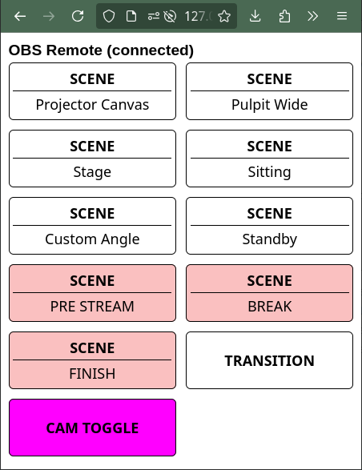

# Simple Web based OBS  remote controller

This repository is a single HTML file, that connects to an OBS instance through websocket.

The point is to be able to create an easy-to-use remote control for OBS that anyone with access can use
to manage the live stream.



Here is a [screen capture](https://github.com/KopiasCsaba/customizeable_obs_remote_html/raw/refs/heads/main/assets/obsremotescreencapture.mp4) as well.

You can customize the following things easily in the source:
 * host,port,password
 * Buttons (label, action, style)

With a bit more understanding you can also customize anything in it of course to your liking.
 
# Features
 * Simplicity
 * Customizability in code
 * Automatic connection & reconnection

# How to use
 * Download the [index.html](https://github.com/KopiasCsaba/customizeable_obs_remote_html/raw/refs/heads/main/index.html) file.
 * Edit connection details first.
 * Open it up and let it connect.
 * Open the web developer toolbar (CTRL+SHIFT+K on firefox, CTRL+SHIFT+J on chrome)
 * Upon first connection there is a dump of hotkey names, scene ids and scene item ids. Use this information to edit the `const hotkeyButtons`.
 * Serve it locally on your device or with a webserver, but don't use https (can't connect to a non-secure websocket from https due to browser policies)
 * Enjoy!

## Serving with docker
Here is a simple docker compose service to serve this file:

```yaml
# <docker-compose.yaml>
services:
  obsremote:
    image: nginx:alpine
    hostname: obsremote
    container_name: obsremote
    network_mode: host
    ports:
      - "80:80"
    volumes:
      - ./obsremote:/usr/share/nginx/html # Make sure to set the folder properly to where the index.html is.
    deploy:
      replicas: 1
      restart_policy:
        condition: any
        delay: 5s
        window: 10s
```

```bash
# Start the container
docker compose up -d obsremote
```
